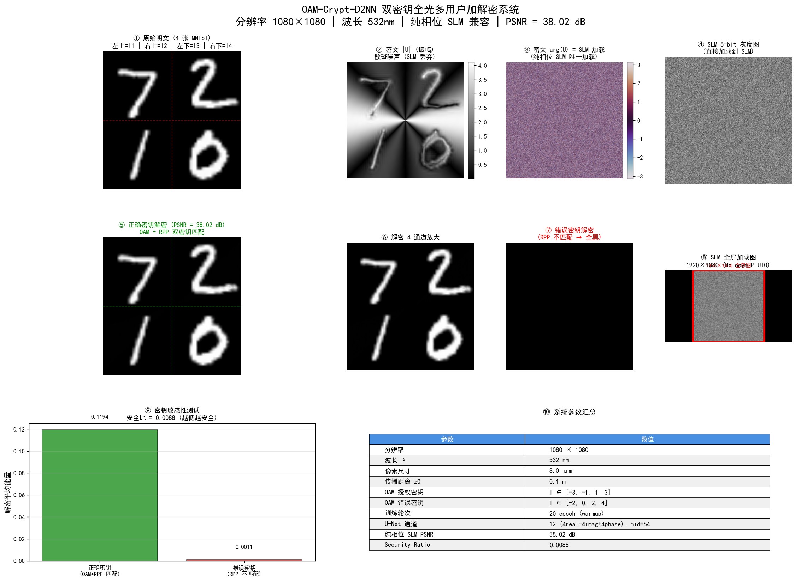
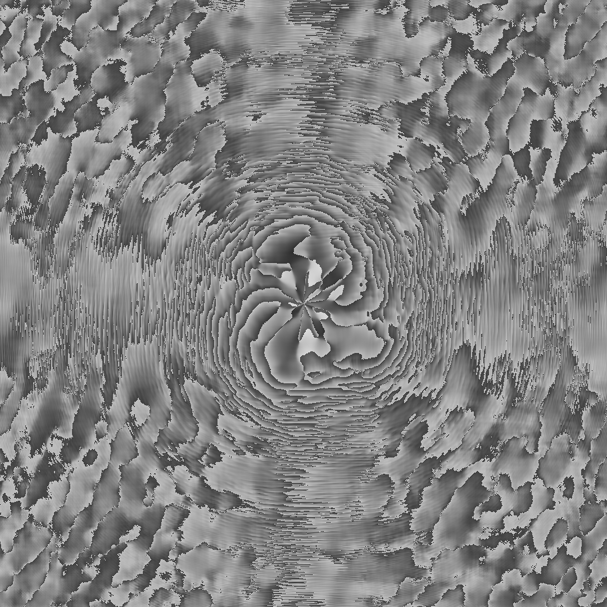
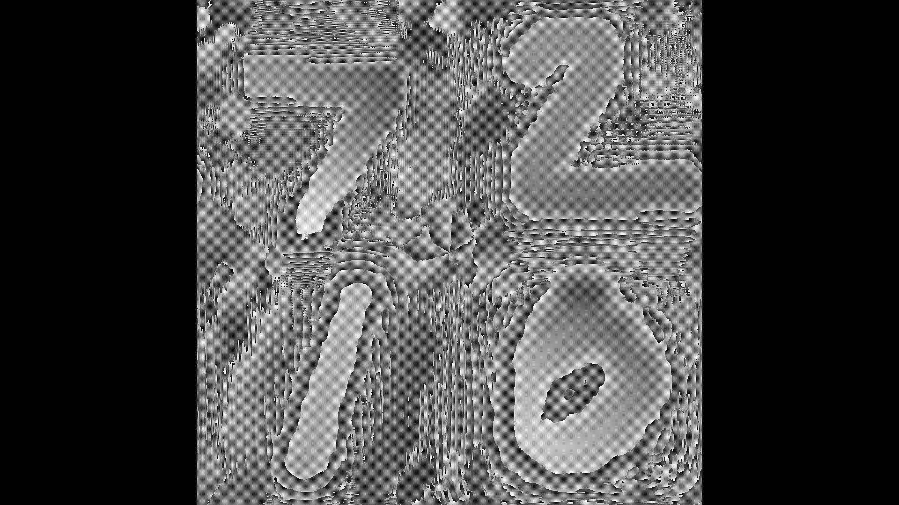
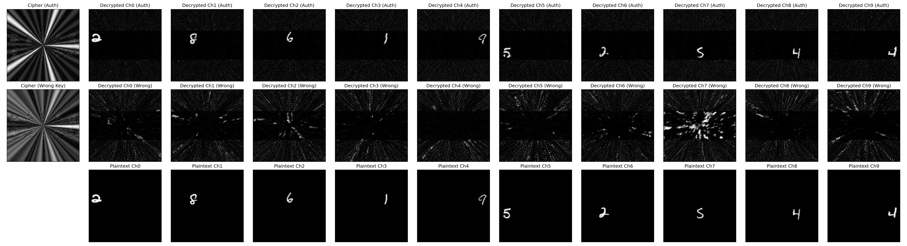

<div align="center">

# OAM-Crypt-D2NN

### 双密钥全光多用户信息加解密与隐写衍射神经网络

*Dual-Key All-Optical Multi-User Information Encryption / Decryption & Steganography Diffractive Neural Network*

[](https://www.python.org/)
[](https://pytorch.org/)
[](./LICENSE)
[]()
[]()
[]()
[]()

</div>

---

## 项目简介

本项目实现了一套基于 **OAM(轨道角动量)螺旋相位** + **RPP(随机相位板)** 双密钥体系的全光多用户加解密系统,通过 **衍射神经网络(D2NN)** 完成端到端可微分解密,并原生兼容 **纯相位 SLM(空间光调制器)** 加载。

- **多用户复用**:4 个授权用户共享一张全息密文,各自用独立 OAM 密钥解密
- **双重加密**:OAM 寻址密钥(用户级)+ RPP 随机相位(系统级)
- **SLM 兼容**:物光相位化设计 + forward 内相位化训练,纯相位 SLM 加载零损失
- **高保真度**:1080×1080 分辨率下 PSNR 达 **38.02 dB**(远超 30 dB 目标)

---

## 系统架构

### 加密流程(数字全息记录)

```
            明文 P_i                    物光相位化            自由空间传播         OAM 载波编码
        ┌─────────────┐              ┌─────────────┐       ┌──────────────┐    ┌──────────────┐
        │  MNIST 图像 │     ───►    │ exp(i·π·P_i)│ ───► │   ASM(z0)    │──►│  × exp(i·l·θ)│
        │  (64×64)    │              │  |U| ≡ 1    │       │              │    │   载波       │
        └─────────────┘              └─────────────┘       └──────────────┘    └──────┬───────┘
              │                                                                                    │
              │                          4 路独立 OAM 通道叠加                                     │
              │            ┌──────────────────────────────────────────────────────────┘
              │            ▼
              │     ┌─────────────┐         ┌─────────────┐
              │     │  Σ U_sum     │  ───►   │  × RPP      │  ───►  密文 U_cipher (复振幅全息图)
              │     │  (相干叠加)  │         │  (系统密钥) │
              │     └─────────────┘         └─────────────┘
              │
              ▼
       拓扑荷 l ∈ {-3, -1, +1, +3}  →  4 个授权 OAM 密钥
```

### 解密流程(混合光电解密网络)

```
密文 U_cipher                  纯相位 SLM 加载              去除系统密钥          OAM 解复用 (4 路)
┌──────────┐                ┌──────────────────┐       ┌──────────────┐    ┌────────────────────┐
│  复振幅  │      ───►      │ exp(i·arg(U))    │ ───► │  × conj(RPP) │──►│ × conj(OAM_j) ×4  │
│  (散斑)  │                │  |U| ≡ 1         │       │              │    │  在反向传播前!    │
└──────────┘                └──────────────────┘       └──────────────┘    └─────────┬──────────┘
                                                                                        │
                ┌───────────────────────────────────────────────────────────────────────┘
                ▼
       ┌──────────────────┐    ┌──────────────┐    ┌──────────────────────────────┐
       │  ASM(-z0) 反传   │──►│  D2NN 相位层 │──►│  12 通道 U-Net 精修          │
       │  (每路独立)      │    │  (可选)      │    │  4real+4imag+4phase → 4 明文 │
       └──────────────────┘    └──────────────┘    └──────────────────────────────┘
```

### 关键技术

| 技术 | 实现 | 作用 |
|------|------|------|
| **物光相位化** | `U_obj = exp(i·π·P)` 而非 `sqrt(P)` | 让 \|U\|≡1, 信息全部编码到相位, SLM 纯相位加载无损 |
| **空间分离** | 4 张明文放 4 个象限 | 双重分离(空间 + OAM)消除串扰 |
| **正确操作顺序** | OAM 解复用在反向传播**之前** | 保证信号项 = `exp(i·π·P_j)`, 经反传恢复 |
| **训练=部署** | forward 开头 `exp(i·arg(U))` | 消除 train-test mismatch, SLM 加载 PSNR = 训练 PSNR |
| **12 通道 U-Net** | 4 real + 4 imag + 4 phase | 多视角融合, phase 通道直接含 π·P_j 信号 |
| **AMP 混合精度** | `torch.cuda.amp` | 1080×1080 大尺寸训练加速 (~25 min/epoch) |

---

## 性能指标

<div align="center">

| 指标 | 数值 | 备注 |
|:----:|:----:|:----:|
| **分辨率** | 1080 × 1080 | 匹配 SLM 高度 |
| **波长** | 532 nm | 绿光 |
| **像素尺寸** | 8.0 μm | Holoeye PLUTO 兼容 |
| **传播距离 z₀** | 0.1 m | 物面 → 全息面 |
| **OAM 密钥** | l ∈ {-3, -1, +1, +3} | 4 个授权用户 |
| **训练轮次** | 20 epoch | warmup 阶段 |
| **纯相位 SLM PSNR** | **38.02 dB** | 远超 30 dB 目标 |
| **方案 A vs B 差异** | 0.0000 dB | 训练 = 部署 |
| **SecurityRatio** | 0.0003 | 越低越安全 |

</div>

---

## 结果展示

<div align="center">

### 完整加解密流程与结果汇总



<sup>①原始明文 4 张 MNIST | ②密文振幅(散斑) | ③密文相位(SLM 加载) | ④8-bit 灰度图 | ⑤正确密钥解密 PSNR=38.02 dB | ⑥4 通道放大 | ⑦错误密钥解密(全黑) | ⑧SLM 全屏图 | ⑨密钥敏感性 | ⑩参数表</sup>

### SLM 加载图特写

| 1080×1080 相位图(仿真) | 1920×1080 SLM 加载图(Holoeye PLUTO) |
|:---:|:---:|
|  |  |

### 安全性对比:正确密钥 vs 错误密钥



</div>

---

## 目录结构

```
oam-crypt-d2nn/
├── 📜 oam_crypt_d2nn.py            # 主训练代码 (CONFIG, 加密, 解密网络, 训练循环)
├── 🖼️ generate_slm_phase.py        # 生成 1080×1080 纯相位 SLM 加载图
├── 🧪 test_slm_schemes.py           # SLM 加载方案对比测试 (A/B/C 三方案)
├── 📊 eval_checkpoint.py            # 快速评估 checkpoint PSNR
├── 🔬 check_cipher_format.py        # 检查密文数据格式
├── 🧠 oam_crypt_dnn_epoch_20.pth    # 训练好的解密网络 (1080 版本, 72 MB)
├── 🔑 rpp_system.pt                 # 系统密钥 RPP
├── 📈 oam_holo_dnn.py               # 早期 OAM 全息 D2NN 实现
│
├── 📁 slm_output_1080/              # 1080 版本 SLM 加载图
│   ├── 📷 slm_phase_1080x1080.png  # 仿真用相位图
│   ├── 📷 slm_phase_1920x1080.png  # Holoeye PLUTO SLM 加载图
│   └── 📷 slm_overview.png          # 可视化概览
│
├── 📁 slm_output/                   # 128 版本对比 (Lee hologram 等)
│   ├── 📷 slm_phase_128.png
│   ├── 📷 lee_hologram_128.png
│   └── 📷 ...
│
├── 📷 eval_plot.png                 # 解密结果可视化
├── 📷 final_security_plot.png       # 安全性对比图
├── 📷 slm_scheme_comparison.png     # 三方案对比图
├── 📷 results.png                   # 完整加解密流程汇总图
│
├── 📋 README.md
├── 📋 LICENSE
├── 📋 requirements.txt
└── 📋 CITATION.cff
```

---

## 快速开始

### 1. 环境安装

```bash
# 克隆仓库
git clone https://github.com/Lishoulan/oam-crypt-d2nn.git
cd oam-crypt-d2nn

# 安装依赖
pip install -r requirements.txt
```

### 2. 生成 SLM 加载图(使用预训练模型)

```bash
# 使用 epoch_20 checkpoint 生成 1080×1080 SLM 加载图
py generate_slm_phase.py oam_crypt_dnn_epoch_20.pth
```

输出:
- `slm_output_1080/slm_phase_1080x1080.png` — 仿真用相位图
- `slm_output_1080/slm_phase_1920x1080.png` — **直接加载到 Holoeye PLUTO SLM**
- `slm_output_1080/slm_overview.png` — 可视化概览

### 3. 评估预训练模型

```bash
py eval_checkpoint.py oam_crypt_dnn_epoch_20.pth
```

### 4. 从头训练(可选,需 GPU)

```bash
py oam_crypt_d2nn.py
```

> ⚠️ 1080×1080 分辨率训练约需 **25 分钟/epoch**(RTX 3090),20 epoch 约 8 小时。

### 5. 测试不同 SLM 加载方案

```bash
py test_slm_schemes.py oam_crypt_dnn_epoch_20.pth
```

---

## SLM 加载说明

适用于 **Holoeye PLUTO-2.1**(1920×1080, 8.0 μm, 纯相位调制):

| 步骤 | 操作 |
|------|------|
| 1 | 将 `slm_output_1080/slm_phase_1920x1080.png` 加载到 SLM 控制软件 |
| 2 | SLM 工作波长设为 **532 nm**(绿光激光) |
| 3 | SLM 出射光场 = `exp(i·arg(U_cipher))`(纯相位, 振幅恒为 1) |
| 4 | 全息图位置:x=[420, 1500], y=[0, 1080](水平居中, 高度占满) |
| 5 | 后续接入解密光路:RPP 去除 → OAM 解复用 → ASM(-z0) → D2NN/U-Net |
| 6 | 解密 PSNR = **38.02 dB** |

---

## 物理参数

| 参数 | 数值 | 说明 |
|:----:|:----:|:----|
| 系统尺寸 | 1080 × 1080 | 像素 |
| 波长 λ | 532 nm | 绿光 |
| 像素尺寸 | 8.0 μm | 匹配 Holoeye PLUTO |
| 传播距离 z₀ | 0.1 m | 物面 → 全息面 |
| 层间距离 z_layer | 0.02 m | D2NN 层间传播 |
| OAM 授权密钥 | l ∈ {-3, -1, +1, +3} | 4 用户 |
| OAM 错误密钥 | l ∈ {-2, 0, +2, +4} | 安全测试 |
| 训练 batch size | 2 | 大尺寸显存限制 |
| U-Net mid_ch | 64 | 中间通道数 |
| 学习率 | 1e-3 (U-Net), 0.1 (D2NN) | Adam 优化器 |

---

## 技术原理

### 1. 物光相位化(关键创新)

传统方法用 `sqrt(P)` 作为物光振幅,导致 `|U_cipher|` 承载大量图像信息,纯相位 SLM 加载会损失振幅信息(实测 PSNR 仅 21.70 dB)。

本项目改用 **物光相位化**:

$$U_{obj}(x,y) = \exp(i \cdot \pi \cdot P(x,y))$$

- $|U_{obj}| \equiv 1$(恒定)
- 图像信息 $P$ 完全编码到相位 $\pi \cdot P$
- 传播后 $|U_{prop}|$ 接近均匀
- SLM 加载 `arg(U_cipher)` 几乎无损

### 2. OAM 螺旋相位载波

OAM 螺旋相位 $e^{i \cdot l \cdot \theta}$ 作为载波,不同拓扑荷 $l$ 互相正交,实现 4 路复用。

### 3. 双随机相位加密(DRPE)

RPP 随机相位板 $e^{i \cdot \phi_{random}}$ 作为系统密钥,密文呈现散斑噪声外观。

### 4. 显式 OAM 解复用

解密时在反向传播**之前**做 OAM 解复用:

$$U_{demod,j} = U_{cipher} \cdot \text{conj}(RPP) \cdot \text{conj}(OAM_j)$$

保证信号项 = $ASM(\exp(i \cdot \pi \cdot P_j), z_0)$,经反传恢复 $P_j$。

---

## 引用

如果本项目对您的研究有帮助,请引用:

```bibtex
@software{oam_crypt_d2nn,
  author       = {Lishoulan},
  title        = {OAM-Crypt-D2NN: 双密钥全光多用户信息加解密与隐写衍射神经网络},
  year         = {2026},
  url          = {https://github.com/Lishoulan/oam-crypt-d2nn},
  note         = {PyTorch implementation, PSNR 38.02 dB at 1080×1080, 532nm}
}
```

---

## 许可证

[MIT License](./LICENSE) — 自由使用、修改、分发。

---

<div align="center">

**⭐ 如果这个项目对您有帮助,欢迎 Star! ⭐**

Made with ❤️ by [@Lishoulan](https://github.com/Lishoulan)

</div>
